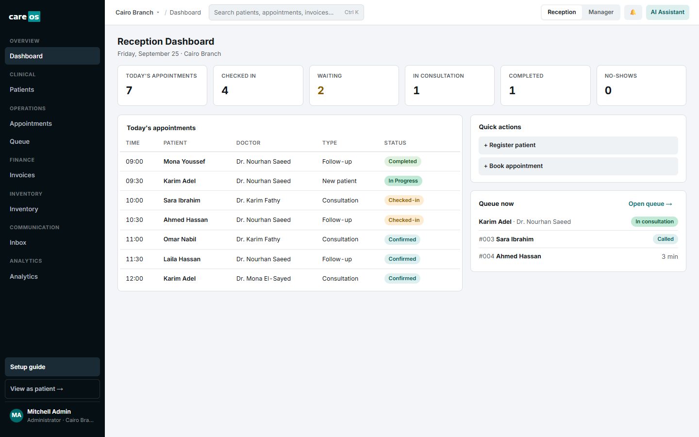
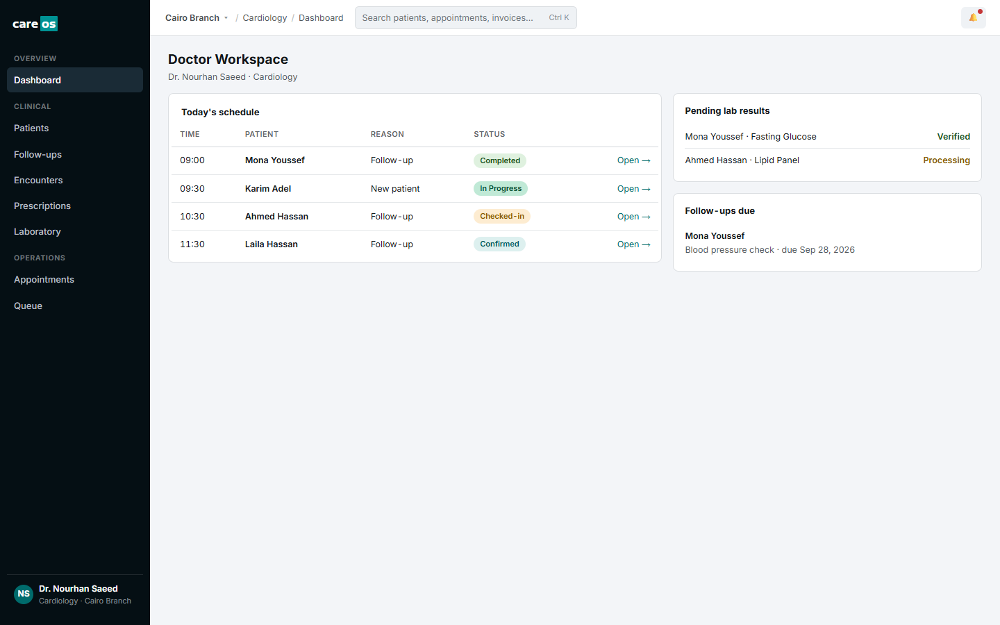
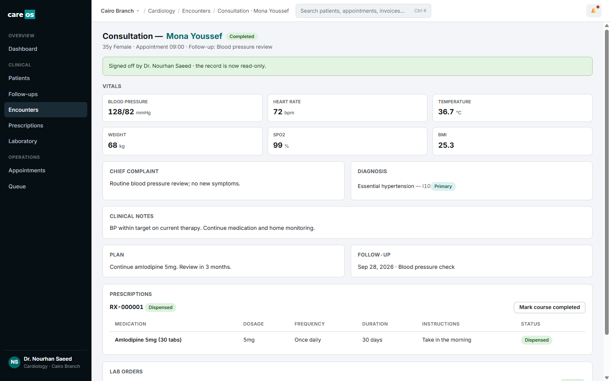
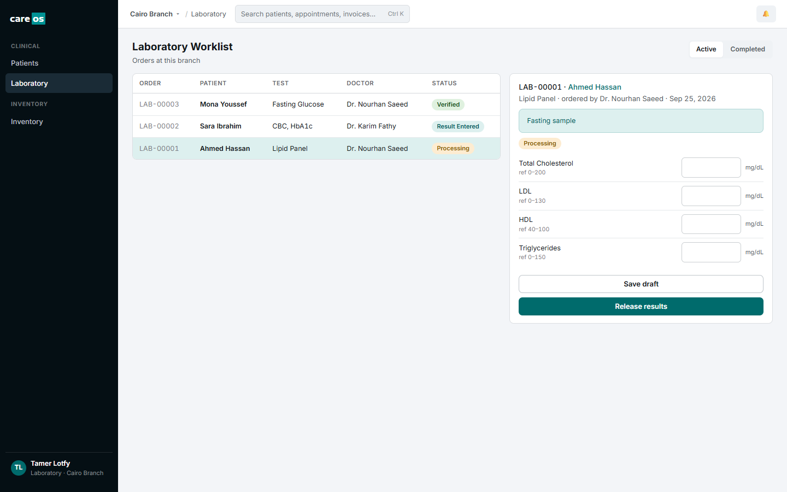
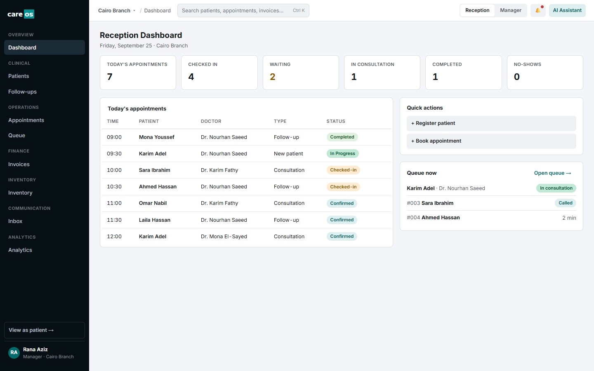
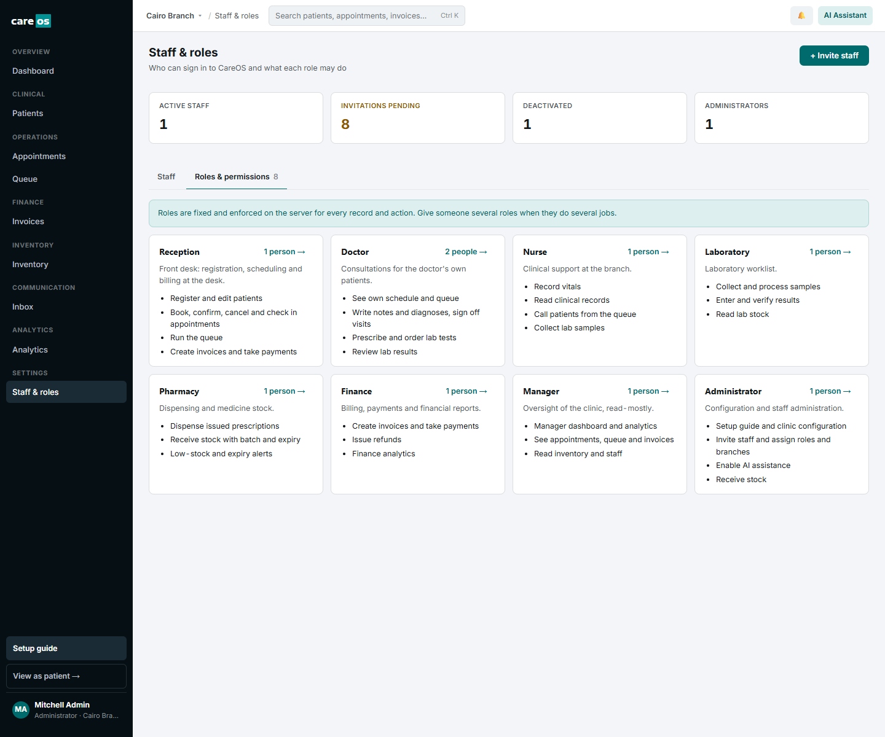
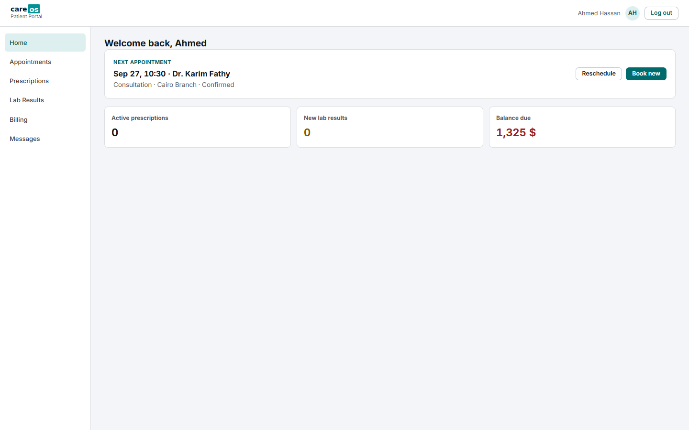

# CareOS — the operating system for modern clinics

CareOS runs a clinic group end to end on **Odoo 19**: patient registration, scheduling, check-in and the
live queue, consultations, prescriptions and dispensing, laboratory, inventory, billing, patient
messaging, analytics, assistive AI and a patient portal.

Odoo supplies the engine (ORM, security, accounting, stock, mail, portal). CareOS supplies the clinical
domain model and a purpose-built, full-screen web app for each role. Staff never see the generic Odoo
back office.



---

## Contents

- [What it does](#what-it-does)
- [A patient's journey](#a-patients-journey)
- [Screenshots](#screenshots)
- [Architecture](#architecture)
- [Modules](#modules)
- [Getting started](#getting-started)
- [Demo accounts](#demo-accounts)
- [Running the tests](#running-the-tests)
- [Security model](#security-model)
- [AI assistance](#ai-assistance)
- [Project layout](#project-layout)
- [Known limitations](#known-limitations)
- [Documentation](#documentation)

---

## What it does

Each role lands on its own workspace and only sees what it is allowed to see.

| Role | Main workspace | What they do |
|---|---|---|
| **Reception** | Reception dashboard | Register patients (with duplicate detection), book and reschedule appointments, check patients in, run the queue, create invoices and take payments, answer patient messages |
| **Doctor** | Doctor workspace | See today's patients, open the consultation, record notes and diagnoses, prescribe, order lab tests, review results, sign the visit off, plan follow-ups |
| **Nurse** | Queue | Call patients, record vitals (blood pressure, heart rate, temperature, weight, SpO2; BMI calculated), collect lab samples |
| **Laboratory** | Lab worklist | Collect → process → enter results (abnormal values flagged against reference ranges) → verify |
| **Pharmacy** | Prescriptions, Inventory | Dispense issued prescriptions (stock is consumed first-expiry-first-out), receive stock with batch and expiry, act on low-stock and expiry alerts |
| **Finance** | Invoices | Bill visits (consultation, lab and medication lines), register payments, issue refunds, follow overdue balances |
| **Manager** | Manager dashboard, Analytics | Revenue this month, visits, no-show rate, outstanding balances, revenue per department, room/provider utilisation, operations / finance / patient analytics |
| **Administrator** | Setup guide, Staff & roles | Configure the organisation in 8 guided steps, invite staff, assign roles and branches, deactivate accounts, enable AI |
| **Patient** | Patient portal | See upcoming appointments and request or reschedule them, prescriptions, verified lab results, invoices (pay online), message the clinic |

Shared across the app:

- **Patient 360.** One page per patient with overview, appointments, clinical history, lab results,
  medications, billing, communication, documents, notes and a timeline of everything that happened.
- **Global search / command palette** (`Ctrl K`): patients, appointments, encounters, prescriptions,
  lab orders and invoices. Results depend on the user's permissions.
- **Notifications bell.** "Prescription ready to dispense", "Lab results ready for review", "Low stock",
  "New patient message", "No-show rate rising" and more, each linking to the record.
- **Multi-branch.** Every user works in a current branch, can switch between their allowed branches, and
  only sees operational data for those branches. Working days and hours are set per branch.
- **Audit trail.** Patient, allergy and condition changes are tracked (who, when, old → new); staff access
  changes are logged; AI requests are audited.

## A patient's journey

```
 Register ──► Book ──► Confirm ──► Check in ──► Queue ──► Consultation ──► Sign-off
  (reception)                     (ticket #004)  (nurse:   (doctor: notes,       │
                                                  vitals)   diagnosis, Rx, lab)  │
                                                                                 ▼
 Portal ◄── Pay ◄── Invoice ◄──────────── Dispense (pharmacy) · Results (lab) ◄──┘
 (patient sees verified results, prescriptions, balance; messages the clinic)
```

Every step is a real state transition enforced on the server:

| Record | States |
|---|---|
| Appointment | Draft → Confirmed → Checked-in → In Progress → Done · Cancelled · No-show |
| Queue ticket | Waiting → Called → In Consultation → Completed · No-show |
| Encounter | Open → Done (needs a diagnosis; then read-only) |
| Prescription | Draft → Issued → Dispensed → Completed · Cancelled |
| Lab order | Ordered → Sample Collected → Processing → Result Entered → Verified → Completed |
| Invoice | Draft → Pending → Partially paid → Paid · Overdue · Refunded (native Odoo invoices) |

Check-in issues the queue ticket and opens the encounter in the same transaction. Starting or finishing the
consultation moves the queue, and signing off completes the appointment. Invoices are built from the
visit's consultation fee, lab tests and dispensed medication.

## Screenshots

| | |
|---|---|
| **Doctor workspace**  | **Consultation**  |
| **Lab worklist**  | **Manager dashboard**  |
| **Staff & roles**  | **Patient portal**  |

All data in the screenshots is synthetic demo data.

## Architecture

```
┌──────────────────────────── Browser ────────────────────────────┐
│  CareOS shell (OWL, full screen)          Patient portal (OWL)  │
│  sidebar · topbar · screens · dialogs     /careos/portal        │
└───────────────┬─────────────────────────────────┬───────────────┘
                │ JSON-RPC (careos_* methods)     │ portal routes
┌───────────────▼─────────────────────────────────▼───────────────┐
│  CareOS service layer        role check first, then scoped sudo │
│  careos.billing · careos.inventory · careos.analytics ·         │
│  careos.staff · careos.portal · careos.ai · careos.setup        │
├─────────────────────────────────────────────────────────────────┤
│  CareOS domain models       patient · appointment · queue ·     │
│  encounter · diagnosis · prescription · lab order · reminder    │
├─────────────────────────────────────────────────────────────────┤
│  Odoo 19                    ORM · groups · record rules · mail ·│
│  account (invoices/payments) · stock (lots, expiry) · portal    │
└─────────────────────────────────────────────────────────────────┘
                            PostgreSQL
```

Key decisions:

- **Odoo's own objects wherever they fit.** Invoices are `account.move`, payments go through the payment
  register, refunds use reversals, medicines are stock products with lots and expiry. There is no parallel
  accounting or stock model.
- **Modules plug into each other through registries.** The base shell exposes JavaScript registries
  (screens, dashboards, Patient 360 tabs and cards, encounter sections, queue actions, topbar items) and
  Python hooks (timeline events, transitions, dashboards, search providers). A module adds its UI to
  another module's screen without the lower module knowing about it. Dependencies only point downward.
- **One design system.** Tokens (colour, type, radius, motion) are CSS custom properties scoped to
  `.careos`; components use `co-` classes. The design source is a Claude Design project; see
  [docs/design-system.md](docs/design-system.md).
- **No fake UI.** Every number, list and chart is read from the database. Demo data is generated relative
  to the install date so dashboards are populated on day one.

## Modules

| Module | Adds |
|---|---|
| `careos_base` | App shell, design system, branches and departments, the 8 roles, branch context, global search, notifications, **Staff & roles** |
| `careos_patients` | Patient registry, contacts, allergies, conditions, documents, notes, Patient Directory, Patient 360 |
| `careos_appointments` | Providers, rooms, visit types, conflict-free booking, appointment lifecycle, schedule and list views, reception dashboard |
| `careos_queue` | Queue tickets issued at check-in, live queue board, calling patients |
| `careos_clinical` | Encounters, vitals, diagnoses, notes and plan, sign-off, doctor workspace, follow-ups |
| `careos_inventory` | Medicines and supplies on Odoo stock, batches and expiry, receiving, low-stock alerts |
| `careos_prescriptions` | Prescribing, allergy warnings, dispensing, current medications |
| `careos_laboratory` | Test catalogue with reference ranges, lab orders, worklist, verified results |
| `careos_finance` | Visit billing, payments and refunds on native invoices, invoices workspace |
| `careos_communications` | Patient message threads, inbox, email appointment reminders |
| `careos_analytics` | Manager dashboard and analytics |
| `careos_ai` | Assistive AI drawer (Claude), de-identified context, human review, audit |
| `careos_portal` | Patient portal and "View as patient" preview for staff |
| `careos` | Meta module that installs everything, plus the setup guide |

Install `careos` to get the whole suite. Full details are in [docs/modules.md](docs/modules.md).

## Getting started

### Prerequisites

- Python **3.12**
- PostgreSQL **14+** (developed on 18) with a role that can create databases
- Odoo **19.0** source (not included in this repository)
- Google Chrome, only for the browser tests

### 1. Get the code

```bash
git clone https://github.com/real-GBOY/clinicOS.git
cd clinicOS
git clone --depth 1 --branch 19.0 https://github.com/odoo/odoo.git odoo
```

### 2. Python environment

```bash
python -m venv .venv
# Windows: .venv\Scripts\activate    macOS/Linux: source .venv/bin/activate
pip install -r odoo/requirements.txt
pip install anthropic freezegun websocket-client
```

`anthropic` is used by the AI module, `freezegun` by the tests, and `websocket-client` by the browser tours.

### 3. Database role

```sql
CREATE ROLE odoo WITH LOGIN CREATEDB PASSWORD 'odoo';
```

### 4. Configuration

```bash
cp odoo.conf.example odoo.conf
```

Edit `odoo.conf`:

- `addons_path`: point it at your `odoo/addons`, `odoo/odoo/addons` and `custom_addons` folders.
- `data_dir`: point it at a writable folder.
- `admin_passwd`: set a strong password.

`odoo.conf` is git-ignored, so keep secrets there.

> **Windows note:** the example sets `db_template = template1` because Windows PostgreSQL rejects the
> collation Odoo uses when cloning `template0`.

### 5. Create a database

With demo data (sample clinic, staff, patients and eight weeks of history):

```bash
python odoo/odoo-bin -c odoo.conf -d careos_demo --with-demo -i careos --stop-after-init
```

For a real clinic (empty), start without demo data and set the company's country and currency first, so the
accounting setup matches your country:

```bash
python odoo/odoo-bin -c odoo.conf -d careos -i careos_base --stop-after-init
# set the company's country/currency (e.g. Egypt / EGP) in Settings, then:
python odoo/odoo-bin -c odoo.conf -d careos -i careos --stop-after-init
```

### 6. Run

```bash
python odoo/odoo-bin -c odoo.conf -d careos_demo
# Windows shortcut: .\run.ps1 -d careos_demo
```

Open <http://localhost:8069> and sign in. CareOS opens automatically for staff accounts. It is also at
`/odoo/action-careos_base.action_careos_app`.

On a fresh database, sign in as the administrator and follow the **Setup guide** (sidebar). It walks
through organisation, branch, departments, doctors, working hours, visit types, prices and staff
invitations. Staff receive an email to set their own password, so configure an outgoing mail server for
invitations and reminders.

## Demo accounts

Demo databases only. **The password equals the login.**

| Login | Role | Name |
|---|---|---|
| `reception` | Reception | Salma Adel |
| `doctor` | Doctor (Cardiology) | Dr. Nourhan Saeed |
| `doctor2` | Doctor | Dr. Karim Fathy |
| `nurse` | Nurse | Hoda Mansour |
| `lab` | Laboratory | Tamer Lotfy |
| `pharmacist` | Pharmacy | Mariam Farid |
| `finance` | Finance | Youssef Samir |
| `manager` | Manager | Rana Aziz |
| `admin` | Administrator | Mitchell Admin |
| `patient` | Patient portal (Ahmed Hassan) | open <http://localhost:8069/careos/portal> |

Staff can also preview the portal from any Patient 360 page with **View as patient →**.

The demo schedule is created relative to the install date. To re-seed today's clinic later:

```python
# python odoo/odoo-bin shell -c odoo.conf -d careos_demo
env["careos.appointment"]._careos_demo_schedule(); env["careos.appointment"]._careos_demo_queue(); env.cr.commit()
```

## Running the tests

All CareOS tests are tagged `careos`: 180 tests, including browser tours for registration, booking, the
reception day, a full doctor visit, the patient portal and staff administration.

```bash
python odoo/odoo-bin -c odoo.conf -d careos_ci --with-demo -i careos --test-enable \
  --test-tags /careos_base,/careos_patients,/careos_appointments,/careos_queue,/careos_clinical,/careos_inventory,/careos_prescriptions,/careos_laboratory,/careos_finance,/careos_communications,/careos_analytics,/careos_ai,/careos_portal,/careos \
  --http-port 8079 --stop-after-init --log-level=test
```

In Git Bash on Windows, prefix the command with `MSYS_NO_PATHCONV=1`, otherwise `/careos_base` is rewritten
as a Windows path. Date-dependent tests run on a frozen clock, and the AI tests mock the model call. See
[docs/testing.md](docs/testing.md) for what each suite covers.

## Security model

The server enforces every permission. Hiding a button is never the only control.

- **Roles** are Odoo security groups: Reception, Doctor, Nurse, Laboratory, Pharmacy, Finance, Manager,
  Administrator. A person can hold several.
- **Access rules** decide what each role may read, create, edit or delete. Nobody can delete patients.
- **Record rules** limit rows: staff see their branches, doctors see their own schedule, portal users see
  only their own record, and everything is scoped per company.
- **Field-level restrictions:** conditions and blood type are readable by clinical roles only.
- **Transition rules:** only doctors prescribe and sign off, only the lab verifies results, only pharmacy
  dispenses, only finance refunds.
- **Service layers** check the caller's role before any elevated read, and return linked records only if
  the caller may see them.
- **Staff administration** is admin-only. Admins cannot remove their own admin role or deactivate
  themselves, there is always at least one active admin, and every change is logged.
- **Passwords** are never set or seen by other staff; invitations use Odoo's set-password link.

The full role × action matrix is in [docs/security.md](docs/security.md).

## AI assistance

The **AI Assistant** drawer summarises a patient, drafts clinical notes for an encounter, and explains a
reception day, a manager dashboard or an invoice. It uses Anthropic's Claude.

- **Off by default.** An administrator enables it and enters an Anthropic API key.
- **De-identified.** Names, patient IDs, phone numbers, emails and national IDs are removed and free text
  is scrubbed before anything is sent.
- **Assistive only.** Output is labelled *AI-GENERATED · REQUIRES REVIEW*. Nothing is written to a chart
  until a clinician chooses to apply it.
- **Audited.** Every request, apply and dismiss is recorded.

## Project layout

```
clinicOS/
├── custom_addons/          CareOS modules (this is the product)
│   ├── careos_base/
│   │   ├── models/         one file per model / service
│   │   ├── security/       groups, access rules, record rules
│   │   ├── data/ demo/     required records / synthetic demo records
│   │   ├── static/src/     shell, components, screens (OWL + CSS)
│   │   ├── static/tests/   browser tours
│   │   └── tests/          Python tests
│   └── careos_…/           same layout per module
├── docs/                   architecture, modules, domain model, security, design system, testing, backlog
├── odoo/                   Odoo 19 source (not versioned)
├── odoo.conf.example       configuration template (copy to odoo.conf)
└── run.ps1                 Windows dev-server shortcut
```

Conventions: public RPC methods are prefixed `careos_` and check permissions explicitly; CSS classes are
prefixed `co-` and use design tokens; demo files contain synthetic people only.

## Known limitations

- **SMS reminders:** no SMS provider is connected. Email reminders work once an outgoing mail server is
  configured.
- **Online payment:** "Pay now" in the portal needs an Odoo payment provider to be configured.
- **Demo currency:** in demo databases Odoo's accounting demo data switches the company to USD. Real
  databases use whatever currency you set before installing.
- **Refreshing:** the queue, dashboards and notifications refresh on a timer rather than by push.
- **Timezones:** times display in the browser's timezone. Keep staff machines on the branch timezone.
- **Admin screens:** some configuration (rooms, visit types, providers) still uses standard Odoo forms.

The full list is in [docs/backlog.md](docs/backlog.md).

## Documentation

| Document | Covers |
|---|---|
| [docs/architecture.md](docs/architecture.md) | Design sources, platform decisions, resolved design conflicts |
| [docs/modules.md](docs/modules.md) | Every module, its dependencies, and the extension points between them |
| [docs/domain-model.md](docs/domain-model.md) | Models, fields and state machines |
| [docs/security.md](docs/security.md) | Roles, permission matrices, record rules, portal and AI safeguards |
| [docs/design-system.md](docs/design-system.md) | Tokens, components, layout rules |
| [docs/development.md](docs/development.md) | Environment, commands, demo data, adding a screen |
| [docs/testing.md](docs/testing.md) | How to run the tests and what each suite proves |
| [docs/backlog.md](docs/backlog.md) | Known issues and deferred work |

## License

LGPL-3.0, as declared in each module's manifest.
